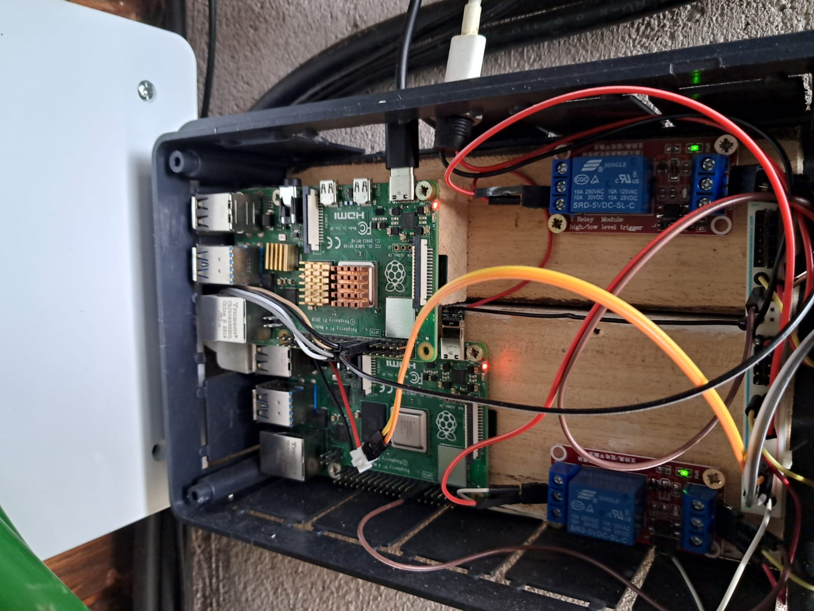
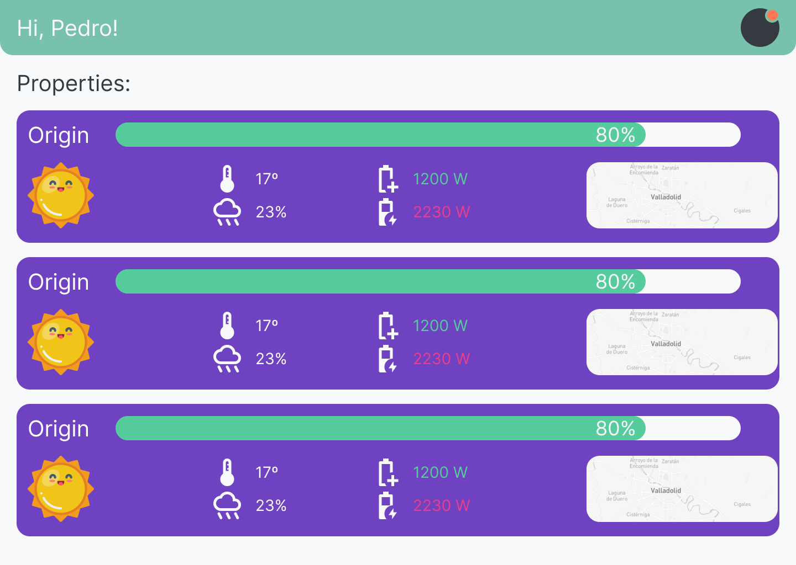

# Portfolio-SergioDeIscar

Porfolio/CV realizado con ThreeJs, Unity, Blender y Needle Engine.

## Descripción

Este proyecto es un portfolio interactivo 3D en el que a través de la interacción con el entorno se puede acceder a información sobre mí y mis proyectos.

## Sobre mí

Soy un programador autodidacta con experiencia en el desarrollo de aplicaciones web, móviles, videojuegos y multiplataforma. En 2017, comencé a sumergirme en el mundo de la programación, comenzando con Unity y Blender para la creación de pequeños juegos 3D.

Estudié Desarrollo de Aplicaciones Multiplataforma en el IES Luis Vives donde adquirí conocimientos en programación orientada a objetos, orientada a eventos, entornos concurrentes, bases de datos...

Actualmente, estoy trabajando como desarrollador de software en [Ahyres](https://ahyres.com/), donde estoy involucrado en el desarrollo de un SaaS para la gestión y planificación de vuelos de drones.

## Proyectos

### BigPig

Proyecto destacado, un juego creado con el motor gráfico Unity. En este juego, los jugadores gestionan y dirigen su propia granja, cultivando diversos cultivos, criando animales y mejorando constantemente bienes de producción (infraestructura). La inclusión de diferentes climas y diversas mecánicas hacen que la experiencia sea entretenida y dinámica.

[ver más...](http://bigpig.somee.com/)

### Virtual Origen: Smart Home

Virtual Origen es una aplicación diseñada para optimizar el uso de la energía en una finca tecnológicamente avanzada situada en las afueras de Cebolla, Toledo. El proyecto tiene como objetivo gestionar los recursos energéticos de la finca de manera eficiente y automática, basándose exclusivamente en la energía solar almacenada en baterías debido a la falta de suministro eléctrico convencional. La aplicación permite la gestión inteligente de dispositivos de alto consumo y sistemas de riego, adaptándose a variables como las condiciones climáticas y el estado de las baterías.

[ver más...](https://github.com/SergioDeIscarValera/VirtualOrigen)

### PomoFlutter

Aplicación web/android realizada con flutter, como base de datos utiliza Firebase (Auth, Firestore, y Hosting) para la gestión eficiente de tareas utilizando el método pomodoro.

[ver más...](https://github.com/SergioDeIscarValera/PomoFlutter)

[ver web...](https://pomo-flutter.web.app/)

### ClimaFlutter

Aplicación android/web con flutter consumiendo la api [AEMET OpenData](https://opendata.aemet.es/dist/index.html) y como base de datos Firebase (Auth, FireStore, Messaging y Hosting).

[ver más...](https://github.com/SergioDeIscarValera/ClimaFlutter)

[ver web...](https://clima-flutter-db.firebaseapp.com/)

## Screenshots

### PokeFlutter

Aplicación android con flutter ([GetX](https://pub.dev/packages/get)) consumiendo la api [PokeApi](https://pokeapi.co/) y como base de datos Firebase (Auth y FireStore).

[ver más...](https://github.com/SergioDeIscarValera/PokeFlutter)

