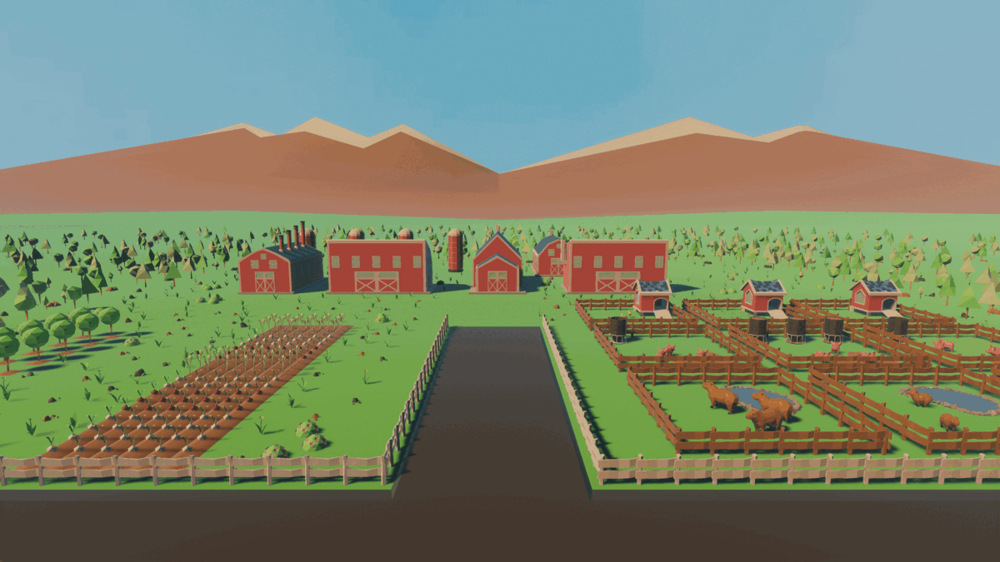
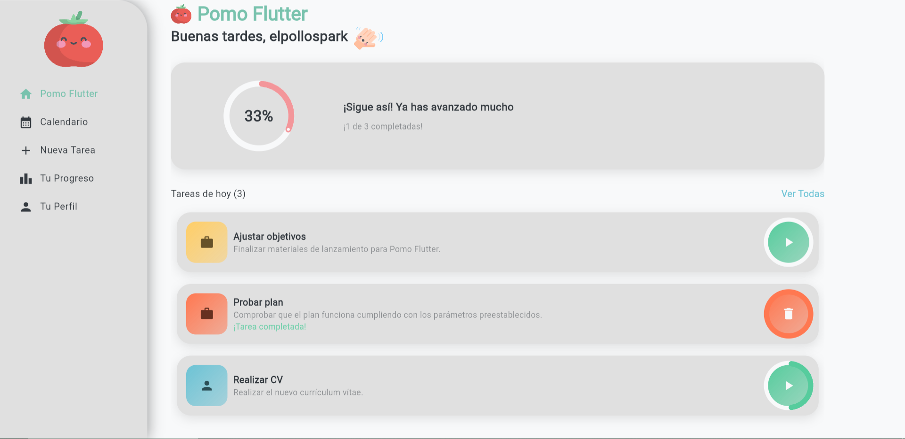
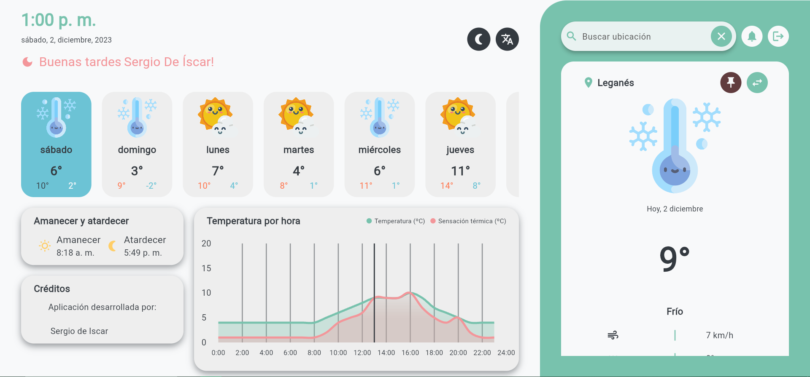
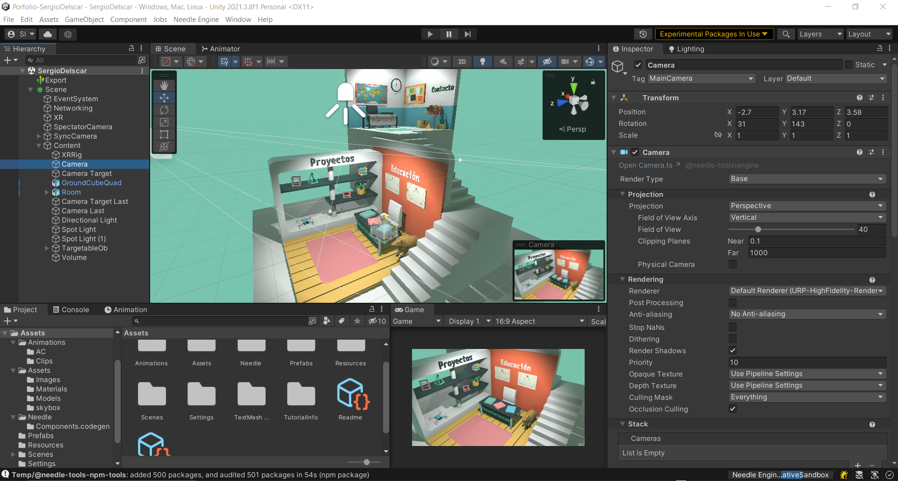
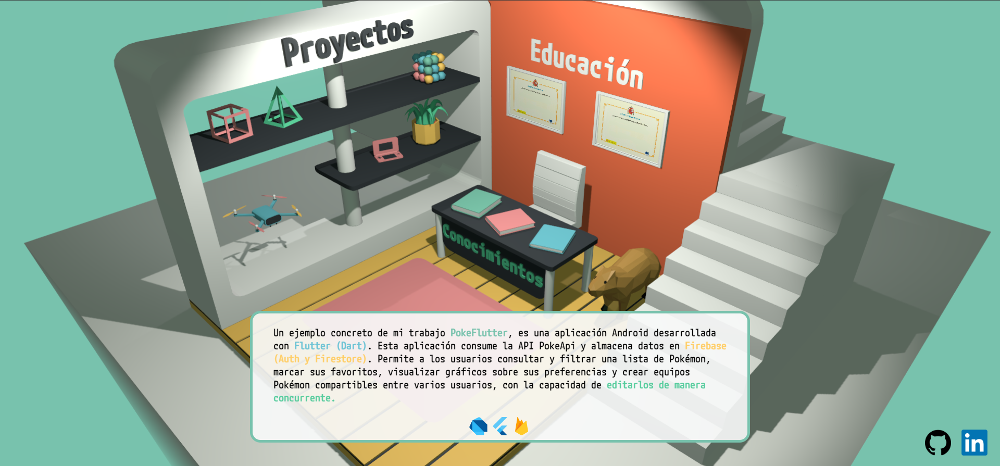
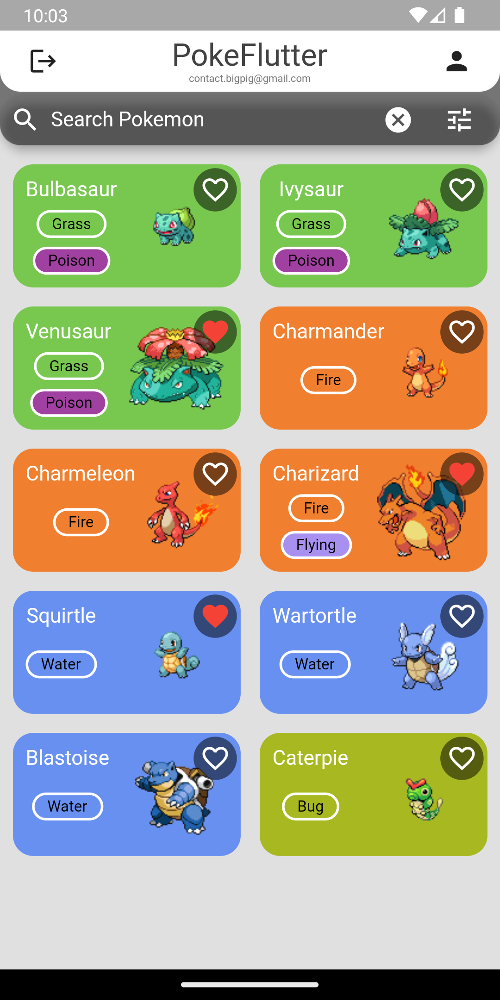

# Portfolio-SergioDeIscar

Porfolio/CV realizado con ThreeJs, Unity, Blender y Needle Engine.

## Descripción

Este proyecto es un portfolio interactivo 3D en el que a través de la interacción con el entorno se puede acceder a información sobre mí y mis proyectos.

## Sobre mí

Soy un estudiante de 2º de Desarrollo de Aplicaciones Multiplataforma en el IES Luis Vives. Desde 2017, me sumergí en el mundo de la programación, comenzando con Unity y Blender para la creación de pequeños juegos 3D.

A lo largo de este tiempo, he ampliado mis conocimientos significativamente, aprendiendo programación orientada a objetos, orientada a eventos, entornos concurrentes, bases de datos, administración de sistemas Linux y Windows...

## Proyectos

### BigPig

Proyecto destacado, un juego creado con el motor gráfico Unity. En este juego, los jugadores gestionan y dirigen su propia granja, cultivando diversos cultivos, criando animales y mejorando constantemente bienes de producción (infraestructura). La inclusión de diferentes climas y diversas mecánicas hacen que la experiencia sea entretenida y dinámica.

[ver más...](http://bigpig.somee.com/)

### PomoFlutter

Aplicación web/android realizada con flutter, como base de datos utiliza Firebase (Auth, Firestore, y Hosting) para la gestión eficiente de tareas utilizando el método pomodoro.

[ver más...](https://github.com/SergioDeIscarValera/PomoFlutter)

[ver web...](https://pomo-flutter.web.app/)

### ClimaFlutter

Aplicación android/web con flutter consumiendo la api [AEMET OpenData](https://opendata.aemet.es/dist/index.html) y como base de datos Firebase (Auth, FireStore, Messaging y Hosting).

[ver más...](https://github.com/SergioDeIscarValera/ClimaFlutter)

[ver web...](https://clima-flutter-db.firebaseapp.com/)

## Screenshots

### PokeFlutter

Aplicación android con flutter ([GetX](https://pub.dev/packages/get)) consumiendo la api [PokeApi](https://pokeapi.co/) y como base de datos Firebase (Auth y FireStore).

[ver más...](https://github.com/SergioDeIscarValera/PokeFlutter)

